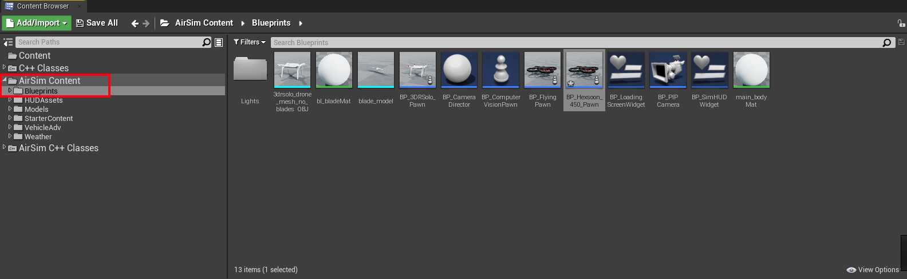
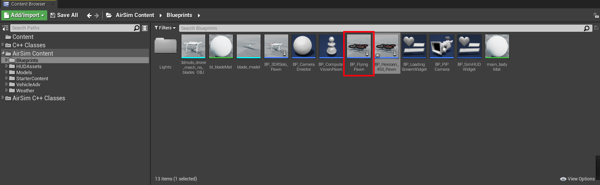
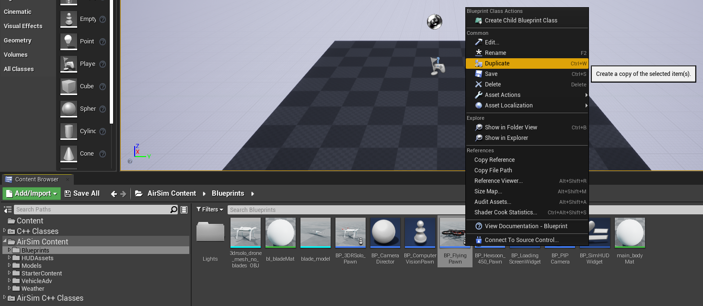
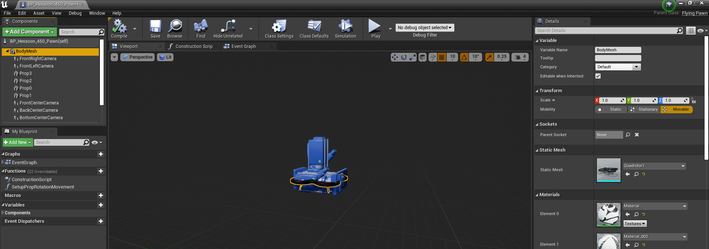

# Custom Drone Meshes

Adding custom drone meshes to AirSim is fairly straightforward once you understand the workflow.
- Have a 3D model for the desired drone.
- Consolidate drone model into one piece and reduce number of triangles (mesh reduction)
- Have 3D model for drone propellers
- Enter Unreal and duplicate the default AirSim drone.
- Create custom drone asset in unreal by importing 3D model and blades
- Link pieces together in asset builder.

### Model Consolidation and Mesh Reduction
This step talks about how to reduce model mesh complexity and import drone assets into unreal

### Drone Customization
Using the assets created in the previous step, it is time to customize the drone model in Unreal.

1. Enter Unreal and locate the AirSim content using the content browser.

2. Duplicate the default AirSim drone.

3. Double click to enter the Asset Editor

4. Select the correct drone model

# Custom Virtual Environments